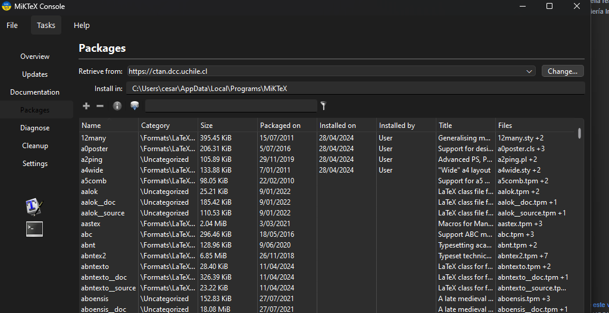
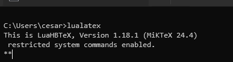
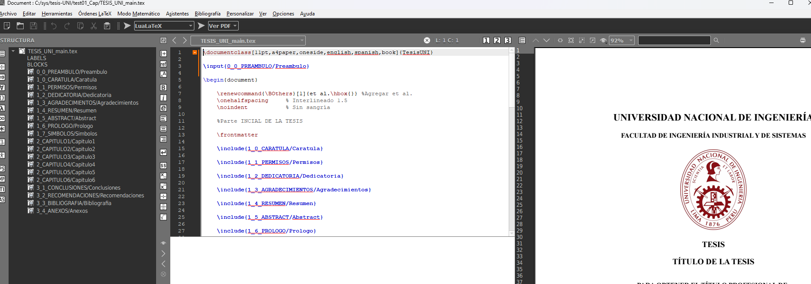
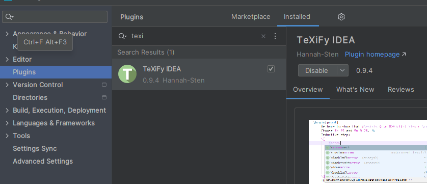
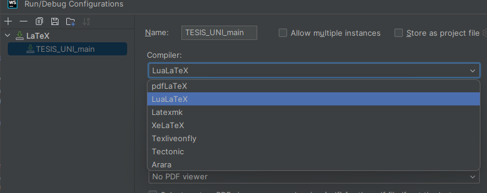

# Plantilla de tesis de pregrado en LaTeX, adaptado al formato de la FIIS UNI

Hola! Soy Ronaldo Farid Nolasco Chavez, ingeniero de sistemas de la UNI.

Como mencioné en
el [manual del egresado](https://drive.google.com/file/d/1PQS89kjKLcwKvXh_ChqI0s8u5DLm2r8D/view?usp=drive_link), la
presente plantilla de tesis, basada en aquella realizada por el compañero Keyvin Saldaña, está adaptada al formato final
de la Facultad de Ingeniería Industrial y de Sistemas (FIIS), aprobada y corroborada por mesa de partes y el veedor de
la FIIS.

Esta plantilla contempla diferentes aspectos:

1. Márgenes del documento
2. Fuente, tamaño de letra, espaciado
3. Capítulos, títulos y subtítulos
4. Figuras y tablas
5. Índice, lista de tablas y figuras
6. Secciones principales de la tesis
7. Referencias a otros autores

## Uso

Para poder utilizar esta plantilla, sigue los siguientes pasos:

### Instalación de compilador

1. Descargar e instalar MiKTeX `https://miktex.org/download`
2. En caso de S.O. Windows Descargar e instalar Perl para MS Windows `https://strawberryperl.com/`
3. Para actualizar paquetes 

### Uso desde IDEs / Editor texto

**Visual Studio Code**

1. Sigue el proceso de instalación del Visual Studio Code + MikTeX, preferiblemente
   de [este video](https://www.youtube.com/watch?v=6evAsCtLsis)
2. En VSCode, utiliza Ctrl + Shift + P, y en la barra de búsqueda, busca "Open Settings (JSON)"
3. Buscar la clave "latex-workshop.latex.recipe.default", su valor muy seguramente sea "latexmk 🔃", reemplázalo por "
   latexmk (xelatex)", y guarda el archivo settings.json

**Texmaker**

1. Descargar e instalar Editor `https://xm1math.net/texmaker/download.html`
2. Configurar (asegurarse de que desde consola pueda acceder
   a `lualatex`) , para salir de consola `Ctrl + C`
3. Pantalla de edición 

**WebStorm**

1. Instalar plugin TeXiFy 
2. Configurar run/debug  

### Utilizar plantilla desde repositorio

1. Clona el repositorio de GitHub a alguna carpeta local con el uso de Git.
2. Abre el proyecto clonado y comienza a editar!

## Contribución

Los forks y pull request son bienvenidos. Para cambios importantes, primero abre un issue para discutir lo que le
gustaría cambiar.
